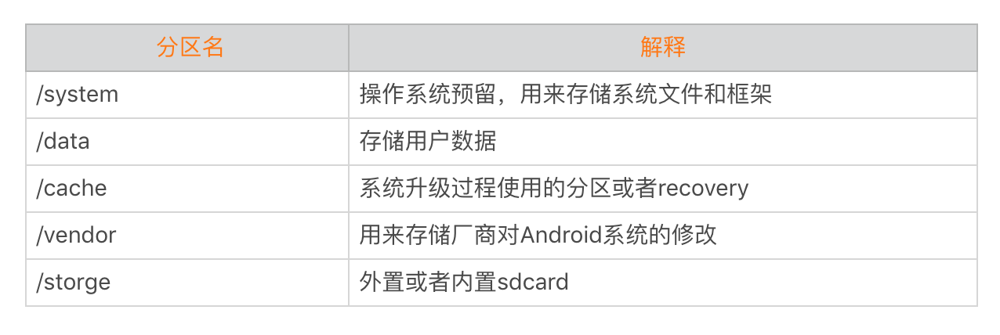
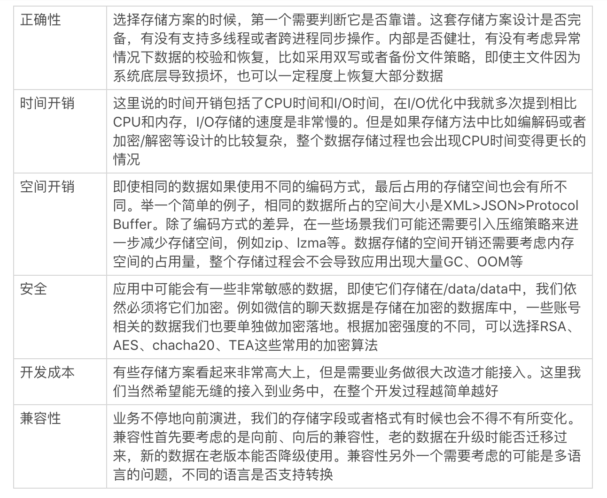
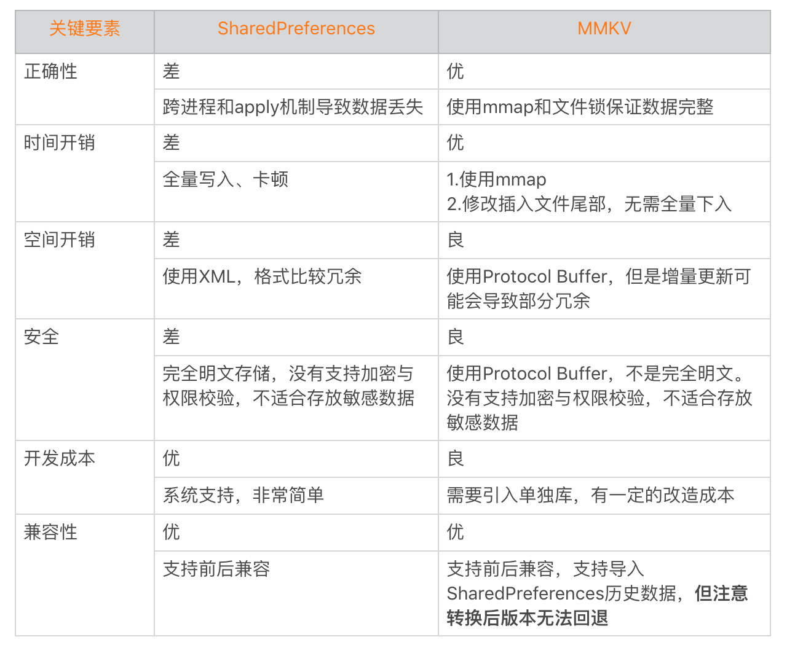
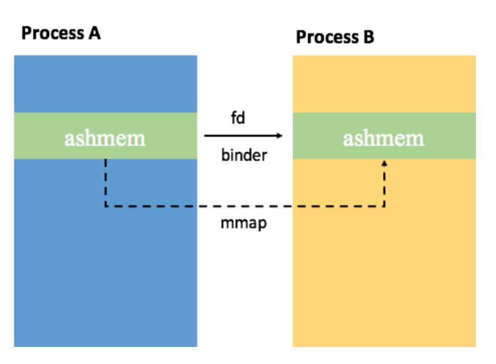
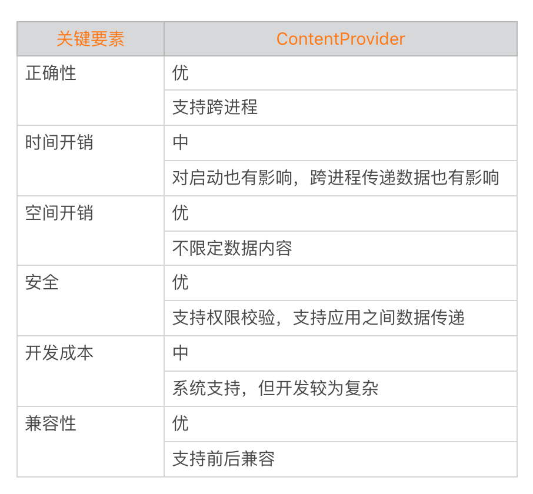
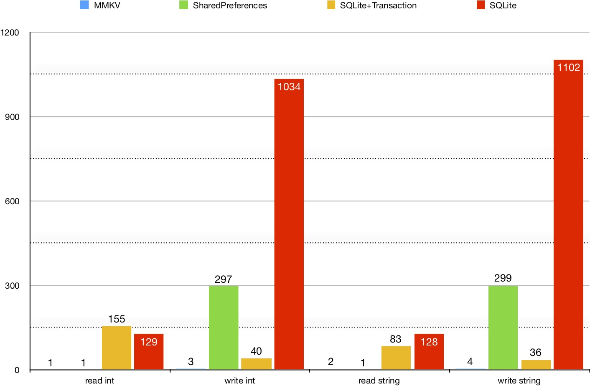

# 12|存储优化（上）：常见的数据存储方法有哪些

通过专栏前面我讲的 I/O 优化基础知识，相信你肯定了解了文件系统和磁盘的一些机制，以及不同 I/O 方式的使用场景以及优缺点，并且可以掌握如何在线上监控 I/O 操作。

万丈高楼平地起，在理解并掌握这些基础知识的同时，你肯定还想知道如何利用这些知识指导我们写出更好的代码。

今天我来结合 Android 系统的一些特性，讲讲开发过程中常见存储方法的优缺点，希望可以帮你在日常工作中如何做出更好的选择。

## Android 的存储基础

在讲具体的存储方法之前，我们应该对 Android 系统存储相关的一些基础知识有所了解。

### 1. Android 分区

I/O 优化中讲到的大部分知识更侧重 Linux 系统，对于 Android 来说，我们首先应该对 Android 分区的架构和作用有所了解。在我们熟悉的 Windows 世界中，我们一般都把系统安装在 C 盘，然后还会有几个用来存放应用程序和数据的分区。

Android 系统可以通过 /proc/partitions 或者 df 命令来查看的各个分区情况，下图是 Nexus 6 中 df 命令的运行结果。


什么是分区呢？分区简单来说就是将设备中的存储划分为一些互不重叠的部分，每个部分都可以单独格式化，用作不同的目的。这样系统就可以灵活的针对单独分区做不同的操作，例如在系统还原（recovery）过程，我们不希望会影响到用户存储的数据。



从上面的表中你可以看到，每个分区非常独立，**不同的分区可以使用的不同的文件系统**。其中比较重要的有：

- /system 分区：它是存放所有 Google 提供的 Android 组件的地方。这个分区只能以只读方式 mount。这样主要基于稳定性和安全性考虑，即使发生用户突然断电的情况，也依然需要保证 /system 分区的内容不会受到破坏和篡改。
- /data 分区：它是所有用户数据存放的地方。主要为了实现数据隔离，即系统升级和恢复的时候会擦除整个 /system 分区，但是却不会影响 /data 的用户数据。而恢复出厂设置，只会擦除 /data 的数据。
- /vendor 分区：它是存放厂商特殊系统修改的地方。特别是在 Android 8.0 以后，隆重推出了[“Treble”](https://source.android.com/devices/architecture)项目。厂商 OTA 时可以只更新自己的 /vendor 分区即可，让厂商能够以更低的成本，更轻松、更快速地将设备更新到新版 Android 系统。

### 2. Android 存储安全

除了数据的分区隔离，存储安全也是 Android 系统非常重要的一部分，存储安全首先考虑的是权限控制。

#### 第一，权限控制

Android 的每个应用都在自己的[应用沙盒](https://source.android.google.cn/security/app-sandbox)内运行，在 Android 4.3 之前的版本中，这些沙盒使用了标准 Linux 的保护机制，通过为每个应用创建独一无二的 Linux UID 来定义。简单来说，我们需要保证微信不能访问淘宝的数据，并且在没有权限的情况下也不能访问系统的一些保护文件。

在 Android 4.3 引入了[SELinux](https://source.android.google.cn/security/selinux)（Security Enhanced Linux）机制进一步定义 Android 应用沙盒的边界。那它有什么特别的呢？它的作用是即使我们进程有 root 权限也不能为所欲为，如果想在 SELinux 系统中干任何事情，都必须先在专门的安全策略配置文件中赋予权限。

#### 第二，数据加密

除了权限的控制，用户还会担心在手机丢失或者被盗导致个人隐私数据泄露。加密或许是一个不错的选择，它可以保护丢失或被盗设备上的数据。

Android 有两种[设备加密方法](https://source.android.google.cn/security/encryption)：全盘加密和文件级加密。[全盘加密](https://source.android.google.cn/security/encryption/full-disk)是在 Android 4.4 中引入的，并在 Android 5.0 中默认打开。它会将 /data 分区的用户数据操作加密 / 解密，对性能会有一定的影响，但是新版本的芯片都会在硬件中提供直接支持。

我们知道，基于文件系统的加密，如果设备被解锁了，加密也就没有用了。所以 Android 7.0 增加了[基于文件的加密](https://source.android.google.cn/security/encryption/file-based)。在这种加密模式下，将会给每个文件都分配一个必须用用户的 passcode 推导出来的密钥。特定的文件被屏幕锁屏之后，直到用户下一次解锁屏幕期间都不能访问。

可能有些同学会问了，Android 的这两种设备加密方法跟应用的加密有什么不同，我们在应用存储还需要单独的给敏感文件加密吗？

我想说的是，设备加密方法对应用程序来说是透明的，它保证我们读取到的是解密后的数据。对于应用程序特别敏感的数据，我们也需要采用 RSA、AES、chacha20 等常用方式做进一步的存储加密。

## 常见的数据存储方法

Android 为我们提供了很多种持久化存储的方案，在具体介绍它们之前，你需要先问一下自己，什么是存储？

每个人可能都会有自己的答案，在我看来，存储就是把特定的数据结构转化成可以被记录和还原的格式，这个数据格式可以是二进制的，也可以是 XML、JSON、Protocol Buffer 这些格式。

对于闪存来说，一切归根到底还是二进制的，XML、JSON 它们只是提供了一套通用的二进制编解码格式规范。既然有那么多存储的方案，那我们在选择数据存储方法时，一般需要考虑哪些关键要素呢？

### 1. 关键要素

在选择数据存储方法时，我一般会想到下面这几点，我把它们总结给你。



那上面这些要素哪个最重要呢？数据存储方法不能脱离场景来考虑，我们不可能把这六个要素都做成最完美。

我来解释一下这句话。如果首要考虑的是正确性，那我们可能需要采用冗余、双写等方案，那就要容忍对时间开销产生的额外影响。同样如果非常在意安全，加解密环节的开销也必不可小。如果想针对启动场景，我们希望选择在初始化时间和读取时间更有优势的方案。

### 2. 存储选项

总的来说，我们需要结合应用场景选择合适的数据存储方法。那 Android 为应用开发者提供了哪些存储数据的方法呢？你可以参考[存储选项](https://developer.android.com/guide/topics/data/data-storage)，综合来看，有下面几种方法。

- SharedPreferences
- ContentProvider
- 文件
- 数据库

今天我先来讲 SharedPreferences 和 ContentProvider 这两个存储方法，文件和数据库将放到“存储优化”后面两期来讲。

#### 第一，SharedPreferences 的使用

[SharedPreferences](http://androidxref.com/9.0.0_r3/xref/frameworks/base/core/java/android/content/SharedPreferences.java)是 Android 中比较常用的存储方法，它可以用来存储一些比较小的键值对集合。

虽然 SharedPreferences 使用非常简便，但也是我们诟病比较多的存储方法。它的性能问题比较多，我可以轻松地说出它的“七宗罪”。

- 跨进程不安全。由于没有使用跨进程的锁，就算使用MODE_MULTI_PROCESS，SharedPreferences 在跨进程频繁读写有可能导致数据全部丢失。根据线上统计，SP 大约会有万分之一的损坏率。
- 加载缓慢。SharedPreferences 文件的加载使用了异步线程，而且加载线程并没有设置线程优先级，如果这个时候主线程读取数据就需要等待文件加载线程的结束。这就导致出现主线程等待低优先级线程锁的问题，比如一个 100KB 的 SP 文件读取等待时间大约需要 50~100ms，我建议提前用异步线程预加载启动过程用到的 SP 文件。
- 全量写入。无论是调用 commit() 还是 apply()，即使我们只改动其中的一个条目，都会把整个内容全部写到文件。而且即使我们多次写入同一个文件，SP 也没有将多次修改合并为一次，这也是性能差的重要原因之一。
- 卡顿。由于提供了异步落盘的 apply 机制，在崩溃或者其他一些异常情况可能会导致数据丢失。所以当应用收到系统广播，或者被调用 onPause 等一些时机，系统会强制把所有的 SharedPreferences 对象数据落地到磁盘。如果没有落地完成，这时候主线程会被一直阻塞。这样非常容易造成卡顿，甚至是 ANR，从线上数据来看 SP 卡顿占比一般会超过 5%。

讲到这里，如果你对 SharedPreferences 机制还不熟悉的话，可以参考[反思｜官方也无力回天？Android SharedPreferences的设计与实现](https://juejin.cn/post/6884505736836022280)与[[Google] 再见 SharedPreferences 拥抱 Jetpack DataStore](https://juejin.cn/post/6881442312560803853)。

坦白来讲，系统提供的 SharedPreferences 的应用场景是用来存储一些非常简单、轻量的数据。我们不要使用它来存储过于复杂的数据，例如 HTML、JSON 等。而且 SharedPreference 的文件存储性能与文件大小相关，每个 SP 文件不能过大，我们不要将毫无关联的配置项保存在同一个文件中，同时考虑将频繁修改的条目单独隔离出来。

我们也可以替换通过复写 Application 的 getSharedPreferences 方法替换系统默认实现，比如优化卡顿、合并多次 apply 操作、支持跨进程操作等。具体如何替换呢？在今天的 Sample 中我也提供了一个简单替换实现。

```java
public class MyApplication extends Application {
  @Override
  public SharedPreferences getSharedPreferences(String name, int mode)        
  {
     return SharedPreferencesImpl.getSharedPreferences(name, mode);
  }
}
```

对系统提供的 SharedPreferences 的小修小补虽然性能有所提升，但是依然不能彻底解决问题。基本每个大公司都会自研一套替代的存储方案，比如微信最近就开源了[MMKV](https://github.com/Tencent/MMKV)。

下面是 MMKV 对于 SharedPreferences 的“六要素”对比。



你可以参考 MMKV 的[实现原理](https://github.com/Tencent/MMKV/wiki/design)和[性能测试报告](https://github.com/Tencent/MMKV/wiki/android_benchmark_cn)，里面有一些非常不错的思路。例如[利用文件锁保证跨进程的安全](https://github.com/Tencent/MMKV/wiki/android_ipc)、使用 mmap 保证数据不会丢失、选用性能和存储空间更好的 Protocol Buffer 代替 XML、支持增量更新等。

根据 I/O 优化的分析，对于频繁修改的配置使用 mmap 的确非常合适，使用者不用去理解 apply() 和 commit() 的差别，也不用担心数据的丢失。同时，我们也不需要每次都提交整个文件，整体性能会有很大提升。

#### 第二，ContentProvider 的使用

为什么 Android 系统不把 SharedPreferences 设计成跨进程安全的呢？那是因为 Android 系统更希望我们在这个场景选择使用 ContentProvider 作为存储方式。ContentProvider 作为 Android 四大组件中的一种，为我们提供了不同进程甚至是不同应用程序之间共享数据的机制。

Android 系统中比如相册、日历、音频、视频、通讯录等模块都提供了 ContentProvider 的访问支持。它的使用十分简单，你可以参考[官方文档](https://developer.android.com/guide/topics/providers/content-providers)。

当然，在使用过程也有下面几点需要注意。

- 启动性能

ContentProvider 的生命周期默认在 Application onCreate() 之前，而且都是在主线程创建的。我们自定义的 ContentProvider 类的构造函数、静态代码块、onCreate 函数都尽量不要做耗时的操作，会拖慢启动速度。


可能很多同学都不知道 ContentProvider 还有一个多进程模式，它可以和 AndroidManifest 中的 multiprocess 属性结合使用。这样调用进程会直接在自己进程里创建一个 push 进程的 Provider 实例，就不需要跨进程调用了。需要注意的是，这样也会带来 Provider 的多实例问题。

- 稳定性

ContentProvider 在进行跨进程数据传递时，利用了 Android 的 Binder 和匿名共享内存机制。简单来说，就是通过 Binder 传递 CursorWindow 对象内部的匿名共享内存的文件描述符。这样在跨进程传输中，结果数据并不需要跨进程传输，而是在不同进程中通过传输的匿名共享内存文件描述符来操作同一块匿名内存，这样来实现不同进程访问相同数据的目的。



正如我前面 I/O 优化所讲的，基于 mmap 的匿名共享内存机制也是有代价的。当传输的数据量非常小的时候，可能不一定划算。所以 ContentProvider 提供了一种 call 函数，它会直接通过 Binder 来传输数据。

Android 的 Binder 传输是有大小限制的，一般来说限制是 1~2MB。ContentProvider 的接口调用参数和 call 函数调用并没有使用匿名共享机制，比如要批量插入很多数据，那么就会出现一个插入数据的数组，如果这个数组太大了，那么这个操作就可能会出现数据超大异常。

- 安全性

虽然 ContentProvider 为应用程序之间的数据共享提供了很好的安全机制，但是如果 ContentProvider 是 exported，当支持执行 SQL 语句时就需要注意 SQL 注入的问题。另外如果我们传入的参数是一个文件路径，然后返回文件的内容，这个时候也要校验合法性，不然整个应用的私有数据都有可能被别人拿到，在 intent 传递参数的时候可能经常会犯这个错误。

最后我给你总结一下 ContentProvider 的“六要素”优缺点。



总的来说，ContentProvider 这套方案实现相对比较笨重，适合传输大的数据。

## 总结

虽然 SharedPreferences 和 ContentProvider 都是我们日常经常使用的存储方法，但是里面的确会有大大小小的暗坑。所以我们需要充分了解它们的优缺点，这样在工作中可以更好地使用和优化。

如何在合适的场景选择合适的存储方法是存储优化的必修课，你应该学会通过正确性、时间开销、空间开销、安全、开发成本以及兼容性这六大关键要素来分解某个存储方法。

在设计某个存储方案的时候也是同样的道理，我们无法同时把所有的要素都做得最好，因此要学会取舍和选择，在存储的世界里不存在全局最优解，我们要找的是局部的最优解。这个时候更应明确自己的诉求，大胆牺牲部分关键点的指标，将自己场景最关心的要素点做到最好。

## 课后作业

下面是 MMKV 给出的性能测试报告，你可以看到跟系统的 SharedPreferences 相比，主要差距在于写的速度。



没有实践就没有发言权，今天我们一起来尝试测试对比 MMKV 与系统 SharedPreferences 的性能差异。请将你的测试结果和分析体会，写在留言区跟同学们分享交流吧。

今天的练习[Sample](https://github.com/AndroidAdvanceWithGeektime/Chapter12)是通过复写 Application 的 getSharedPreferences 方法替换系统默认实现，这种方式虽然不是最好的方法，不过它主要的优点在于代码的侵入性比较低，无需修改太多的代码。
