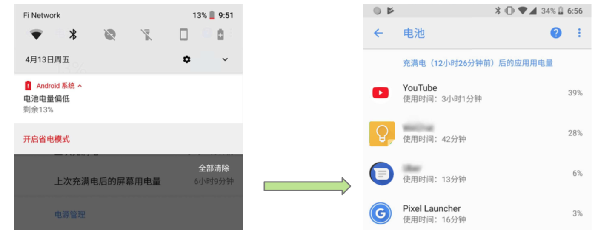
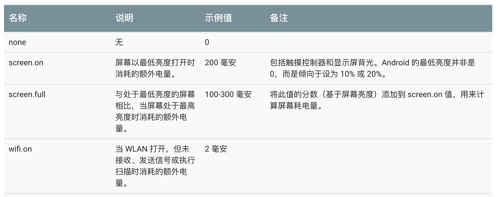
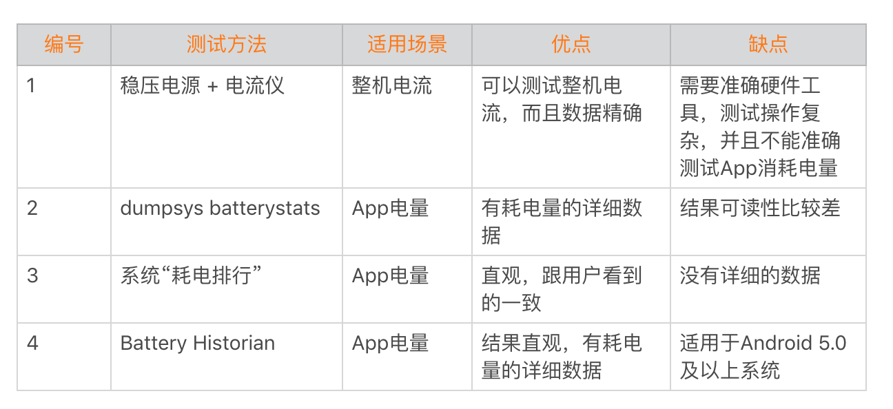
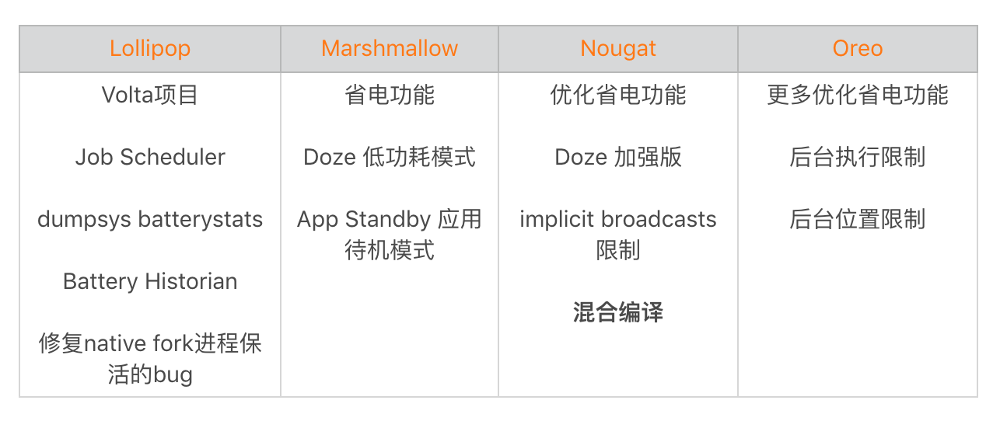
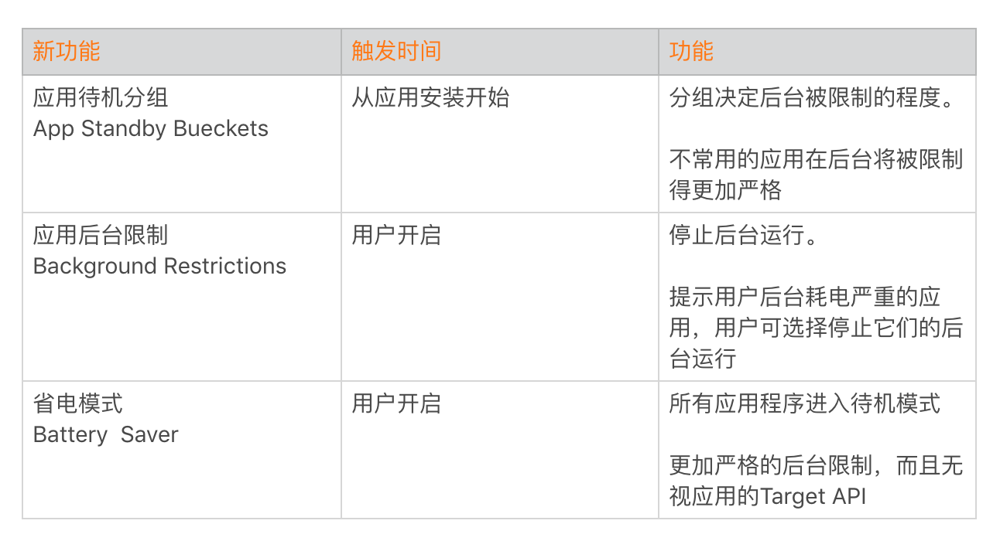

# 18|耗电优化（上）：从电量优化的演进看耗电分析

曾经有一句笑话说的是“用 Android 手机的男人一定是个好男人，因为他每天必须回家充电，有时候还得 1 天 2 次”。

我们现在工作和生活都离不开手机，但是却很难找到一款可以完全信赖、可以使用一整天的手机。在十年前的功能机时代，诺基亚可以做到十几天的超长待机。而现在的智能机时代，7nm 的 CPU、8GB 内存、512GB 的闪存，硬件一直在飞速发展，为什么电池的发展就不适用摩尔定律，电池技术一直没有突破性的进展呢？

功耗是手机厂商一直都非常重视的，OPPO 更是直接以“充电 5 分钟，通话 2 小时”作为卖点。省电优化也是每年 Google I/O 必讲的内容，那么 Android 系统都为省电做了哪些努力呢？我们可以怎么样衡量应用的耗电呢？

## 耗电的背景知识

回顾一下专栏前面的内容，我已经讲过内存、CPU、存储和网络这几块内容了。LPDDR5 内存、7nm  CPU、UFS  3.0 闪存、5G 芯片，硬件一直以“更快、更小”的目标向前飞速发展。

但是手机上有一个重要部件多年来都没有革命性的突破，被我们吐槽也最多，那就是电池。智能手机的发展就像木桶原理一样，扼住智能手机发展咽喉的终究还是电池。

电池技术有哪些重要的评判标准？电池技术这些年究竟又有哪些进展？下面我们一起来聊聊手机电池的知识。

### 1. 电池技术

我们先看看苹果和华为这两大巨头最新旗舰机的表现。苹果的 iPhone XS Max 内置锂离子充电电池，电池容量为 3174mAh，30 分钟最多可充至 50% 电量。
华为 Mate 20 Pro 升级到 4200mAh 高度大容量锂离子电池，并首次搭载 40W 华为超级快充技术，30 分钟充电约 70%，还有 15W 高功率无线快充和反向无线充电“黑科技”。而 Mate 20 X 更是把电池容量升级到 5000mAh，还创造性地将石墨烯技术应用到智能手机中。

从上面两款旗舰机的电池介绍中，我们可以发现手机电池的一些关键指标。

- 电池容量。更大的电池容量意味着更长的续航时间，我们可以通过增加电池的体积或者密度来达到这个效果。智能手机的大部分空间都贡献给电池了，以华为 Mate 20 为例，电池占了所有内部组件中 48% 的空间，电池容量制约了手机迈向更轻、更薄。
- 充电时间。如果电池容量不是那么容易突破，那只能曲线救国考虑如何用更短的时间把电池充满。这里就需要依靠快充技术了，OPPO“充电 5 分钟，通话 2 小时”指的是[VOOC 闪充技术](https://baike.baidu.com/item/VOOC%E9%97%AA%E5%85%85/13887450?fromtitle=%E5%85%85%E7%94%B55%E5%88%86%E9%92%9F%E9%80%9A%E8%AF%9D2%E5%B0%8F%E6%97%B6&fromid=18226496)。快充技术无非是增大电流或者电压，目前主要分为两大解决方案，一个是高压低电流快充方案，另一个是低压大电流快充方案。关于快充技术的盘点，你可以参考[这篇文章](https://g.pconline.com.cn/x/1089/10896724.html)。
- 寿命。电池寿命一般使用充电循环次数来衡量，一次充电循环表示充满电池全部电量，但是并不要求一次性完成。例如在之前电池充到了 25%，如果再充 75%，两次组合在一起算是一次充电周期。去年苹果因为“降速门”面临了多起诉讼，通过处理器限速来解决续航不足的问题。根据苹果官方数据，500 次充电循环 iPhone 电池剩余容量为原来的 80%。
- 安全性。手机作为用户随时携带的物品，安全性才是首要考虑的因素。特别是从三星 Note 7 爆炸以来，各大手机厂商都在电池容量方面更加保守。所以无论是电池的密度，还是快充技术，我们首要保证的都是安全性。

从历史久远的镍铬、镍氢，到现在普遍使用的锂离子电池，还是被称为革命性技术的石墨烯电池，虽然达不到摩尔定律，但电池技术其实也在不停地发展，感兴趣的同学可以参考[《手机电池技术进步》](https://zhuanlan.zhihu.com/p/78814373)。

事实上 Mate 20 X 只是使用石墨烯技术用于散热系统，并不是真正意义上的石墨烯电池。根据最新的研究成果表明，使用石墨烯材料可以让电池容量增加 45%，充电速度可以加快 5 倍，循环寿命更高达 3500 次左右。可能在未来，12 分钟就能把我们的手机电池充满，如果能够实现普及的话，将是电池发展史上的一个重要里程碑。

### 2. 电量和硬件

1000mAh 的功能机我们可以使用好几天，为什么 5000mAh 的智能机我们需要每天充电？这是因为我们现在的手机需要视频通话，需要打“王者”“吃鸡”，硬件设备的种类和性能早就不可同日而语。

但是“王者”“吃鸡”等应用程序不会直接去消耗电池，而是通过使用硬件模块消耗相应的电能，下图是手机中一些比较耗电的硬件模块。


CPU、屏幕、WiFi 和数据网络、GPS 以及音视频通话都是我们日常的耗电大户。坦白说，智能手机硬件的飞速提升，许多其实都是厂商叫卖的噱头。绝大部分硬件对于我们来说都已经处于性能过剩的状态，但多余的性能同时也在消耗电量。

所以资源调度机制是厂商功耗优化最重要的手段，例如在卡顿优化的时候我就讲过，CPU 芯片会分大小核架构，会灵活地为不同任务分配相应的运算资源。手机基带、GPS 这些模块在不使用时也会进入低功耗或者休眠模式，达到降低功耗的目的。

现在越来越多厂商利用深度学习的本地 AI 来优化资源的调度，对 GPU、运行内存等资源进行合理分配，确保可以全面降低耗电量。厂商需要在高性能跟电量续航之间寻找一个平衡点，有的厂商可能倾向于用户有更好的性能，有的厂商会倾向于更长的续航。

功耗的确非常重要，我做手机预装项目时，发现厂商会对耗电有非常严格的规定，这也让我对功耗的认识更深刻了。但是为了为了保证头部应用能有更好的体验，厂商愿意给它们分配更多的资源。所以出现了高通的[CPU Boost](https://developer.qualcomm.com/software/snapdragon-power-optimization-sdk/quick-start-guide)、微信的 Hardcode 以及各个厂商的合作通道。

但是反过来问一句，为什么厂商只把微信和 QQ 放到后台白名单，但没有把淘宝、支付宝、抖音等其他头部应用也一起加入呢？根据我的猜测，耗电可能是其中一个比较重要的因素。

### 3. 电量和应用程序

各个硬件模块都会耗电，而且不同的硬件耗电量也不太一样，那我们如何评估不同应用程序的耗电情况呢？



根据物理学的知识，电能的计算公式为

```java
电能 = 电压 * 电流 * 时间
```

对于手机来说电压一般不会改变，例如华为 Mate 20 的恒定电压是 3.82V。所以在电压恒定的前提下，只需要测量电流和时间就可以确定耗电。

最终不同模块的耗电情况可以通过下面的这个公式计算：

```java
模块电量(mAh) = 模块电流(mA) * 模块耗时(h)
```

模块耗时比较容易理解，但是模块电流应该怎样去获取呢？Android 系统要求不同的厂商必须在 /frameworks/base/core/res/res/xml/power_profile.xml 中提供组件的电源配置文件。

[power_profiler.xml](https://android.googlesource.com/platform/frameworks/base/+/master/core/res/res/xml/power_profile.xml)文件定义了不同模块的电流消耗值以及该模块在一段时间内大概消耗的电量，你也可以参考 Android Developer 文档[《Android 电源配置文件》](https://source.android.com/devices/tech/power)。当然电流的大小和模块的状态也有关系，例如屏幕在不同亮度时的电流肯定会不一样。



Android 系统的电量计算PowerProfile也是通过读取power_profile.xml的数值而已，不同的厂商具体的数值都不太一样，我们可以通过下面的方法获取：

- 从手机中导出/system/framework/framework-res.apk文件。
- 使用反编译工具（如 apktool）对导出文件framework-res.apk进行反编译。
- 查看power_profile.xml文件在framework-res反编译目录路径：/res/xml/power_profile.xml。

对于系统的电量消耗情况，我们可以通过 dumpsys batterystats 导出。

```java
adb shell dumpsys batterystats > battery.txt
// 各个Uid的总耗电量，而且是粗略的电量计算估计。
Estimated power use (mAh):
    Capacity: 3450, Computed drain: 501, actual drain: 552-587
    ...
    Idle: 41.8
    Uid 0: 135 ( cpu=103 wake=31.5 wifi=0.346 )
    Uid u0a208: 17.8 ( cpu=17.7 wake=0.00460 wifi=0.0901 )
    Uid u0a65: 17.5 ( cpu=12.7 wake=4.11 wifi=0.436 gps=0.309 )
    ...
// reset电量统计
adb shell dumpsys batterystats --reset
```

[BatteryStatsService](http://androidxref.com/7.0.0_r1/xref/frameworks/base/services/core/java/com/android/server/am/BatteryStatsService.java)是对外的电量统计服务，但具体的统计工作是由[BatteryStatsImpl](http://androidxref.com/7.0.0_r1/xref/frameworks/base/core/java/com/android/internal/os/BatteryStatsImpl.java)来完成的，而 BatteryStatsImpl 内部使用的就是 PowerProfile。BatteryStatsImpl 会为每一个应用创建一个 UID 实例来监控应用的系统资源使用情况，统计的系统资源包括下面图里的内容。


电量的使用也会跟环境有关，例如在零下十度的冬天电量会消耗得更快一些，系统提供的电量测量方法只是提供一个参考的数值。不过通过上面的这个方法，我们可以成功把电量的测量转化为功能模块的使用时间或者次数。

准确的测量电量并不是那么容易，在[《大众点评 App 的短视频耗电量优化实战》](https://tech.meituan.com/2018/03/11/dianping-shortvideo-battery-testcase.html)一文中，为我们总结了下面几种电量测试的方法。



当测试或者其他人反馈耗电问题时，[bug report](https://developer.android.com/studio/debug/bug-report)结合[Battery Historian](https://github.com/google/battery-historian)是最好的排查方法。

```java
//7.0和7.0以后
$ adb bugreport bugreport.zip
//6.0和6.0之前:
$ adb bugreport > bugreport.txt
//通过historian图形化展示结果
python historian.py -a bugreport.txt > battery.html
```

## Android 耗电的演进历程

虽然 iPhone XS Max 电池容量只有 3174mAh，远远低于大部分 Android 的旗舰机，但是很多时候我们发现它的续航能力会优于大部分的 Android 手机。

仔细想想这个问题就会发现，Android 是基于 Linux 内核，而 Linux 大部分使用在服务器中，它对功耗并没有做非常严格苛刻的优化。特别是国内会有各种各样的“保活黑科技”，大量的应用在后台活动简直就是“电量黑洞”。

那 Android 为了电量优化都做了哪些努力呢？Google I/O 每年都会单独讲解耗电优化，下面我们一起来看看 Android 在耗电方面都做了哪些改变。

### 1. 野蛮生长：Pre Android 5.0

在 Android 5.0 之前，系统并不是那么完善，对于电量优化相对还是比较少的。特别没有对应用的后台做严格的限制，多进程、fork native 进程以及广播拉起等各种保活流行了起来。

用户手机用电如流水，会明显感受到下面几个问题：

- 耗电与安装应用程序的数量有关。用户安装越多的应用程序，无论是否打开它们，手机耗电都会更快。
- App 耗电量与 App 使用时间无关。用户希望 App 的耗电量应该与它的使用时间相关，但是有些应用即使常年不打开，依然非常耗电。
- 电量问题排查复杂。无论是电量的测量，还是耗电问题的排查都异常艰难。

当然在 Android 5.0 之前，系统也有尝试做一些省电相关的优化措施。


### 2. 逐步收紧：Android 5.0～Android 8.0

Android 5.0 专门开启了一个 [Volta](https://developer.android.com/about/versions/android-5.0?hl=zh-cn) 项目，目标是改善电池的续航。在优化电量的同时，还增加了的 dumpsys batteryst 等工具生成设备电池使用情况统计数据。



从 Android 6.0 开始，Google 开始着手清理后台应用和广播来进一步优化省电。在这个阶段还存在以下几个问题：

- 省电模式不够省电。Doze 低功耗模式限制得不够严格，例如屏幕关闭还可以获取位置、后台应用的网络权限等。
- 用户对应用控制力度不够。用户不能简单的对某些应用做更加细致的电量和后台行为的控制，但是其实国内很多的厂商已经提前实现了这个功能。
- Target API 开发者响应不积极。为了不受新版本的某些限制，大部分国内的应用坚持不把 Target API 升级到 Oreo 以上，所以很多省电的功能事实上并没有生效。

### 3. 最严限制：Android 9.0

我在 Android 9.0 刚出来的时候，正常使用了一天手机，在通知栏竟然弹出了下面这样一个提示：微信正在后台严重耗电。
尽管经过几个版本的优化，Android 的续航问题依然没有根本性的改善。但你可以看到的是，从 Android 9.0 开始，Google 对[电源管理](https://developer.android.com/about/versions/pie/power?hl=zh-cn)引入了几个更加严格的限制。



通过应用待机分组功能，我们可以确保应用使用的电量和它们的使用时间成正比，而不是和手机上安装的应用数量成正比。对于不常用的应用，它们可以“作恶”的可能性更小了。通过省电模式和应用后台限制，用户可以知道哪些应用是耗电的应用，我们也可以对它们做更加严格的限制。

另一方面，无论是 Google Play 还是国内的 Android 绿色联盟，都要求应用在一年内更新到最新版本的 Target API。电池续航始终是 Android 的生命线，我相信今年的 Android Q 也会推出更多的优化措施。

## 总结

今天我讲了应用程序、Android 系统、手机硬件与电池之间的关系，也回顾了 Android 耗电优化的演进历程。那落实到具体工作时，我们应该如何去做耗电优化呢？下一期我们来解决这个问题。

在讲内存、CPU、存储和网络这些知识的时候，我都会讲一些硬件相关的知识。主要是希望帮你建立一套从应用层到操作系统，再到硬件的整体认知。当你的脑海里面有一套完整的知识图谱时，才能更得心应手地解决一些疑难问题，进而可以做好对应的性能优化工作。

## 课后作业

今天的课后作业是，在日常的开发过程中，你遇到过哪些耗电问题？遇到这些问题的时候，你一般通过哪些手段去定位和修复呢？欢迎留言跟我和其他同学一起讨论。
