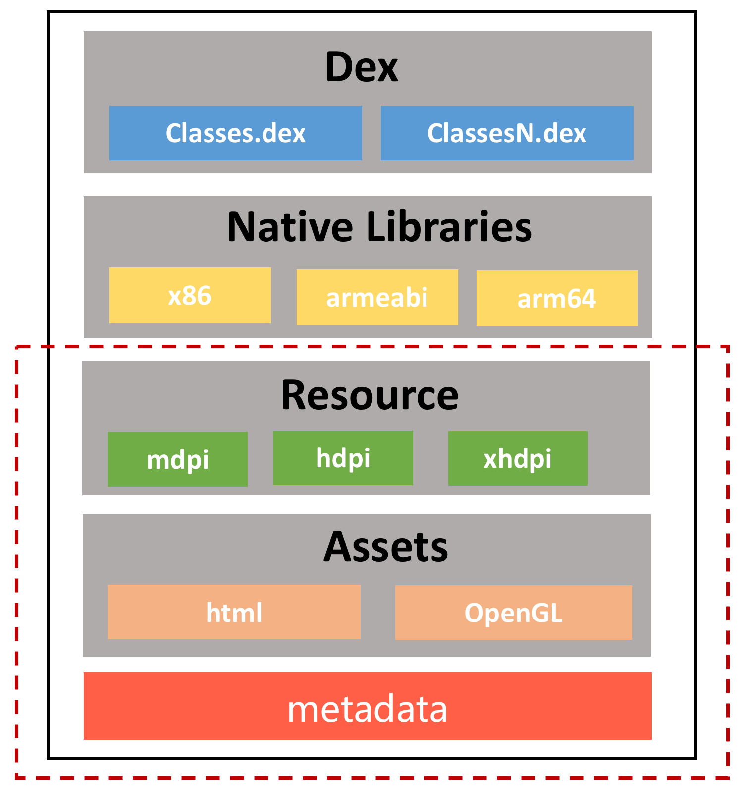
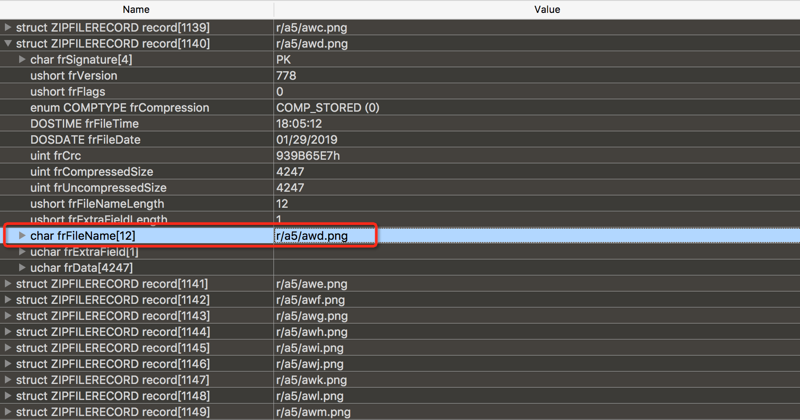
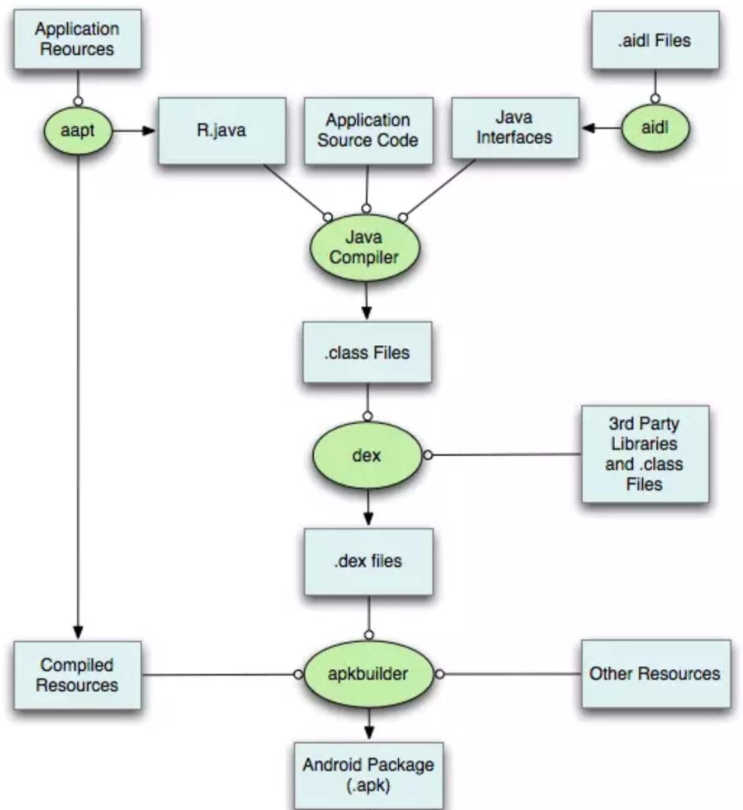
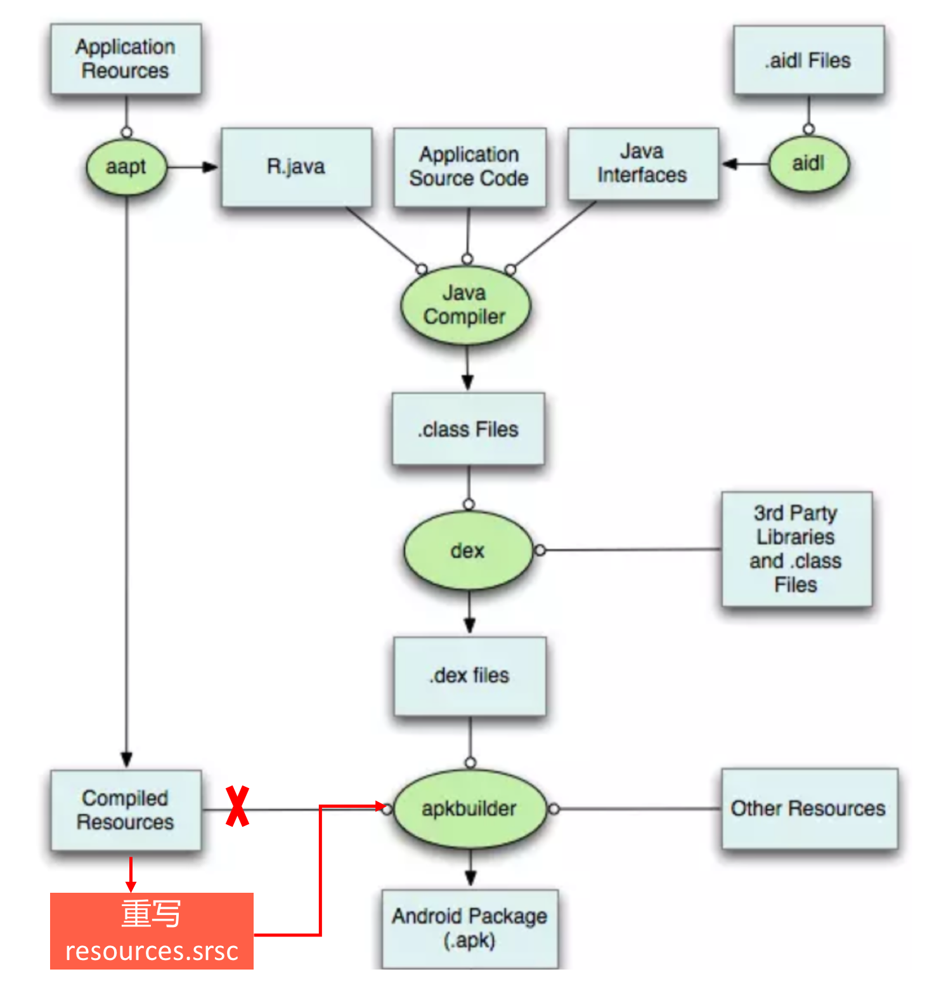

# 23|包体积优化（下）：资源优化的进阶实践

上一期我们聊了 Dex 与 Native Library 的优化，是不是还有点意犹未尽的感觉呢？那安装包还有哪些可以优化的地方呢？



请看上面这张图，Assets、Resource 以及签名 metadata 都是安装包中的“资源”部分，今天我们就一起来看看如何进一步优化资源的体积。

## AndResGuard 工具

在美团的一篇文章[《Android App 包瘦身优化实践》](https://tech.meituan.com/2017/04/07/android-shrink-overall-solution.html)中，也讲到了很多资源优化相关的方法，例如 WebP 和 SVG、R 文件、无用资源、资源混淆以及语言压缩等。

在我们的安装包中，资源相关的文件具体有下面这几个，它们都是我们需要优化的目标文件。


想使用好[AndResGuard](https://github.com/shwenzhang/AndResGuard)工具，需要对安装包格式以及 Android 资源编译的原理有很深地理解，它主要有两个功能，一个是资源混淆，一个是资源的极限压缩。

接下来我们先来复习一下这个工具的核心实现，然后再进一步思考还有哪些地方需要继续优化。

### 1. 资源混淆

ProGuard 的核心优化主要有三个：Shrink、Optimize 和 Obfuscate，也就是裁剪、优化和混淆。当初我在写 AndResGuard 的时候，希望实现的就是 ProGuard 中的混淆功能。

资源混淆的思路其实非常简单，就是把资源和文件的名字混淆成短路径：

```java
Proguard          -> Resource Proguard
R.string.name     -> R.string.a   
res/drawable/icon -> res/s/a
```

那么这样的实现究竟对哪些资源文件有优化作用呢？

- resources.arsc。因为资源索引文件 resources.arsc 需要记录资源文件的名称与路径，使用混淆后的短路径 res/s/a，可以减少整个文件的大小。
- metadata 签名文件。[签名文件 MF 与 SF](https://cloud.tencent.com/developer/article/1354380)都需要记录所有文件的路径以及它们的哈希值，使用短路径可以减少这两个文件的大小。
- ZIP 文件索引。ZIP 文件格式里面也需要记录每个文件 Entry 的路径、压缩算法、CRC、文件大小等信息。使用短路径，本身就可以减少记录文件路径的字符串大小。



资源文件有一个非常大的特点，那就是文件数量特别多。以微信 7.0 为例，安装包中就有 7000 多个资源文件。所以说，资源混淆工具仅仅通过短路径的优化，就可以达到减少 resources.arsc、签名文件以及 ZIP 文件大小的目的。

既然移动优化已经到了“深水区”，正如 Dex 和 Library 优化一样，我们需要对它们的格式以及特性有非常深入的研究，才能找到优化的思路。而我们要做的资源优化也是如此，要对 resources.arsc、签名文件以及 ZIP 格式需要有非常深入的
研究与思考。

### 2. 极限压缩

AndResGuard 的另外一个优化就是极限压缩，它的极限压缩功能体现在两个方面：

- 更高的压缩率。虽然我们使用的还是 Zip 算法，但是利用了 7-Zip 的大字典优化，APK 的整体压缩率可以提升 3% 左右。
- 压缩更多的文件。Android 编译过程中，下面这些格式的文件会指定不压缩；在 AndResGuard 中，我们支持针对 resources.arsc、PNG、JPG 以及 GIF 等文件的强制压缩。

```java
/* these formats are already compressed, or don't compress well */
static const char* kNoCompressExt[] = {
    ".jpg", ".jpeg", ".png", ".gif",
    ".wav", ".mp2", ".mp3", ".ogg", ".aac",
    ".mpg", ".mpeg", ".mid", ".midi", ".smf", ".jet",
    ".rtttl", ".imy", ".xmf", ".mp4", ".m4a",
    ".m4v", ".3gp", ".3gpp", ".3g2", ".3gpp2",
    ".amr", ".awb", ".wma", ".wmv", ".webm", ".mkv"
};
```

这里可能会有一个疑问，为什么 Android 系统会专门选择不去压缩这些文件呢？

- 压缩效果并不明显。这些格式的文件大部分本身已经压缩过，重新做 Zip 压缩效果并不明显。例如 PNG 和 JPG 格式，重新压缩只有 3%～5% 的收益，并不是十分明显。
- 读取时间与内存的考虑。如果文件是没有压缩的，系统可以利用 mmap 的方式直接读取，而不需要一次性解压并放在内存中。

Android 6.0 之后 AndroidManifest 支持不压缩 Library 文件，这样安装 APK 的时候也不需要把 Library 文件解压出来，系统可以直接 mmap 安装包中的 Library 文件。

```java
android:extractNativeLibs=“true”
```

简单来说，我们在启动性能、内存和安装包体积之间又做了一个抉择。在上一期中我就讲过对于 Dex 和 Library 来说，最有效果的方法是使用 XZ 或者 7-Zip 压缩，对于资源来说也是如此，一些比较大的资源文件我们也可以考虑使用 XZ 压缩，但是在首次启动时需要解压出来。

## 进阶的优化方法

学习完 AndResGuard 工具的混淆和压缩功能的实现原理后，可以帮助我们加深对安装包格式以及 Android 资源编译的原理的认识。

但 AndResGuard 毕竟是几年前的产物，那现在又有哪些新的进阶优化方法呢？

### 1. 资源合并

在资源混淆方案中，我们发现资源文件的路径对于 resources.arsc、签名信息以及 ZIP 文件信息都会有影响。而且因为资源文件数量非常非常多，导致这部分的体积非常可观。

那我们能不能把所有的资源文件都合并成同一个大文件，这样做肯定会比资源混淆方案效果更好。


事实上，大部分的换肤方案也是采用这个思路，这个大资源文件就相当于一套皮肤。因此我们完全可以把这套方案推广开来，但是实现起来还是需要解决不少问题的。

- 资源的解析。我们需要模拟系统实现资源文件的解析，例如把 PNG、JPG 以及 XML 文件转换为 Bitmap 或者 Drawable，这样获取资源的方法需要改成我们自定义的方法。

```java
// 系统默认的方式
Drawable drawable = getResouces().getDrawable(R.drawable.loading);
// 新的获取方式
Drawable drawable = CustomResManager.getDrawable(R.drawable.loading);
```

那为什么我们不像 SVG 那样，直接把这些解析完的所有 Drawable 全部丢到系统的缓存中呢？这样代码就无需做太多修改？之所以没这么做主要是考虑对内存的影响，如果我们把全部的资源文件一次性全部解析，并且丢到系统的缓存中，这部分会占用非常大的内存。

- 资源的管理。考虑到内存和启动时间，所有的资源也是用时加载，我们只需要使用 mmap 来加载“Big resource File”。同时我们还要实现自己的资源缓存池 ResourceCache，释放不再使用的资源文件，这部分内容你可以参考类似 Glide 图片库的实现。

我在逆向 Facebook 的 App 的时候也发现，它们的资源和多语言基本走的完全是自己的流程。在“UI 优化”时我就说过，我们先在系统的框架下尝试做了很多的优化，但是渐渐发现这样的方式依然要受系统的各种制约，这时就要考虑去突破系统的限制，把所有的流程都接管过来。

当然我们也需要在性能和效率之间寻找平衡点，要看自己的应用当前更重视性能提升还是开发效率。

### 2. 无用资源

AndResGuard 中的资源混淆实现的是 ProGuard 的 Obfuscate，那我们是否可以同样实现资源的 Shrink，也就是裁剪功能呢？应用通过长时间的迭代，总会有一些无用的资源，尽管它们在程序运行过程不会被使用，但是依然占据着安装包的体积。

事实上，Android 官方早就考虑到这种情况了，下面我们一起来看看无用资源优化方案的演进过程。

#### 第一阶段：Lint

从 Eclipse 时代开始，我们就开始使用Lint这个静态代码扫描工具，它里面就支持 Unused Resources 扫描。


然后我们直接选择“Remove All Unused Resources”，就可以轻松删除所有的无用资源了。既然它是第一阶段的方案，那 Lint 方案扫描具体的缺点是什么呢？

Lint 作为一个静态扫描工具，它最大的问题在于没有考虑到 ProGuard 的代码裁剪。在 ProGuard 过程我们会 shrink 掉大量的无用代码，但是 Lint 工具并不能检查出这些无用代码所引用的无用资源。

#### 第二阶段：shrinkResources

所以 Android 在第二阶段增加了“shrinkResources”资源压缩功能，它需要配合 ProGurad 的“minifyEnabled”功能同时使用。

如果 ProGuard 把部分无用代码移除，这些代码所引用的资源也会被标记为无用资源，然后通过资源压缩功能将它们移除。

```java
android {
    ...
    buildTypes {
        release {
            shrinkResources true
            minifyEnabled true
        }
    }
}
```

是不是看起来很完美，但是目前的 shrinkResources 实现起来还有几个缺陷。

- 没有处理 resources.arsc 文件。这样导致大量无用的 String、ID、Attr、Dimen 等资源并没有被删除。
- 没有真正删除资源文件。对于 Drawable、Layout 这些无用资源，shrinkResources 也没有真正把它们删掉，而是仅仅替换为一个空文件。为什么不能删除呢？主要还是因为 resources.arsc 里面还有这些文件的路径，具体你可以查看这个[issues](https://issuetracker.google.com/issues/37010152)。
  
所以尽管我们的应用有大量的无用资源，但是系统目前的做法并没有真正减少文件数量。这样 resources.arsc、签名信息以及 ZIP 文件信息这几个“大头”依然没有任何改善。

那为什么 Studio 不把这些资源真正删掉呢？事实上 Android 也知道有这个问题，在它的核心实现 [ResourceUsageAnalyzer](https://android.googlesource.com/platform/tools/base/+/studio-master-dev/build-system/gradle-core/src/main/java/com/android/build/gradle/tasks/ResourceUsageAnalyzer.java)中的注释也写得非常清楚，并尝试解决这个问题提供了两种思路。

如果想解答系统为什么不能直接把这些资源删除，我们需要先回过头来重温一下 Android 的编译流程。



- 由于 Java 代码需要用到资源的 R.java 文件，所以我们就需要把 R.java 提前准备好。
- 在编译 Java 代码过程，已经根据 R.java 文件，直接将代码中资源的引用替换为常量，例如将 R.String.sample 替换为 0x7f0c0003。
- .ap_ 资源文件的同步编译，例如 resources.arsc、XML 文件的处理等。

如果我们在这个过程强行把无用资源文件删除，resources.arsc 和 R.java 文件的资源 ID 都会改变（因为默认都是连续的），这个时候代码中已经替换过的 0x7f0c0003 就会出现资源错乱或者找不到的情况。

因此系统为了避免发生这种情况，采用了折中的方法，并没有二次处理 resources.arsc 文件，只是仅仅把无用的 Drawable 和 Layout 文件替换为空文件。

#### 第三阶段：realShrinkResources

那怎么样才能真正实现无用资源的删除功能呢？ResourceUsageAnalyzer 的注释中就提供了一个思路，我们可以利用 resources.arsc 中 Public ID 的机制，实现非连续的资源 ID。

简单来说，就是 keep 住保留资源的 ID，保证已经编译完的代码可以正常找到对应的资源。



但是重写 resources.arsc 的方法会比资源混淆更加复杂，我们既要从这个文件中抹去所有的无用资源相关信息，还要 keep 住所有保留资源的 ID，相当于把整个文件都重写了。

正因为异常复杂，所以目前 Android 还没有提供这套方案的完整实现。我最近也正在按照这个思路来实现这套方案，希望完成后可以尽快开源出来。

## 总结

今天我们回顾了 AndResGuard 工具的实现原理，也学习了两种资源优化的进阶方式。特别是无用资源的优化，你可以看到尽管是无所不能的 Google，也并没有把方案做到最好，依然存在一些妥协的地方。

其实这种不完美的地方还有很多很多，也正是有了这些不完美的地方，才会出现各种各样优秀的开源方案。也因此我们才会不断思考如何突破系统的限制，去实现更多、更底层的优化。

### 课后作业

对于 Android 的编译流程，你还有不理解的地方吗？对于安装包中的资源，你还有哪些好的优化方案？欢迎留言跟我和其他同学一起讨论。

不知道你有没有想过，其实“第三阶段”的无用资源删除方案也并不是终极解决方案，因为它并没有考虑到无用的 Assets 资源。

但是对于 Assets 资源，代码中会有各种各样的引用方式，如果想准确地识别出无用的 Assets 并不是那么容易。当初在 Matrix 中，我们尝试提供了一套简单的实现，你可以参考[UnusedAssetsTask](https://github.com/Tencent/matrix/blob/master/matrix/matrix-android/matrix-apk-canary/src/main/java/com/tencent/matrix/apk/model/task/UnusedAssetsTask.java)。

希望你在课后也可以进一步思考，我们可以如何识别出无用的 Assets 资源，在这个过程中会遇到哪些问题？
