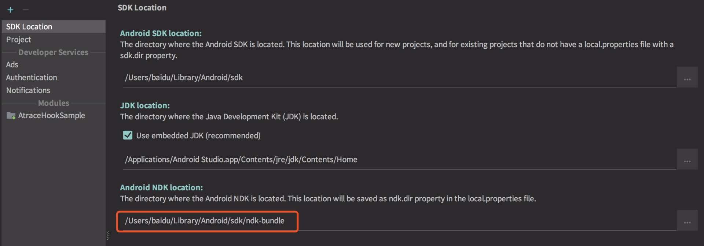
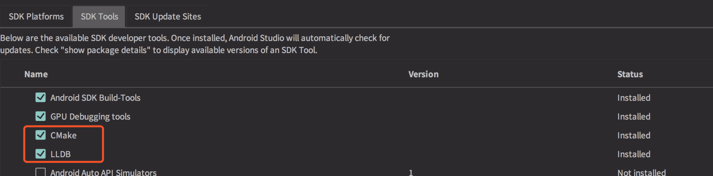
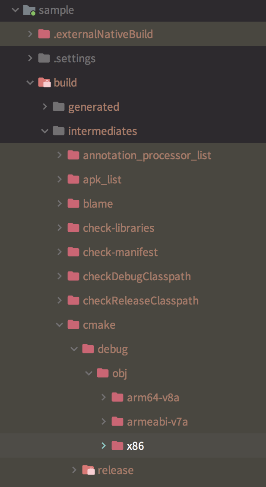
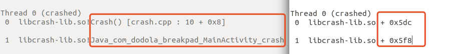

# 01|热点问题答疑第一期'

专栏上线以来很多同学反馈，说在运行练习 Sample 的时候遇到问题。由于这些 Sample 多是采用 C/C++ 来完成的，所以在编译运行上会比传统的纯 Java 项目稍微复杂一些。今天我就针对第 1 期～第 4 期中，同学们集中遇到的问题做一期答疑。设置练习的目的，也是希望你在学习完专栏的内容后，可以快速上手试验一下专栏所讲的工具或方法，帮你加快掌握技术的精髓。所以希望各位同学可以多参与进来，有任何问题也可以在留言区给我们反馈，后面我还会不定期针对练习再做答疑。

## 编译环境配置

首先是同学们问得比较多的运行环境问题。

前几期的练习 Sample 大多是使用 C/C++ 开发的，所以要运行起来需要先配置好 SDK 和 NDK，SDK 我们一般都是配置好的，NDK 环境的配置有一些特殊的地方，一般我们的 Sample 都会使用最新的 NDK 版本，代码可能会使用 C++11/14 的语法进行编写，并且使用 CMake 进行编译，我这里给出 NDK 环境的配置项。

首先需要去 NDK 官网下载[最新版本](http://developer.android.com/ndk/downloads/)，下载后可以解压到合适的地方，一般 macOS 可以存放在 ANDROID_SDK_HOME/ndk_bundle 目录下，Android  Studio 可以默认找到该目录。如果放到别的目录，可能需要自己指定一下。

指定 NDK 目录的方法一般有下面两种。

1. 在练习 Sample 根目录下都会有一个 local.properties 文件，修改其中的 ndk.dir 路径即可。

```java
ndk.dir=/Users/sample/Library/Android/sdk/ndk-bundle
 sdk.dir=/Users/sample/Library/Android/sdk
```

2. 可以在 Android  Studio 里进行配置，打开 File -> Project Structure -> SDK Location 进行修改。



上面两种修改方法效果是一致的。

有些 Sample 需要降级 NDK 编译使用，可能需要下载旧版本的 NDK，可以从[官网下载](http://developer.android.com/ndk/downloads/revision_history)。

之后需要安装 CMake 和 LLDB。

- [CMake](http://cmake.org/)：一款外部构建工具，可与 Gradle 搭配使用来构建原生库。
- [LLDB](http://lldb.llvm.org/)：一种调试程序，Android Studio 使用它来[调试原生代码](http://developer.android.com/studio/debug/index.html?hl=zh-cn)。

这两项都可以在 Tools > Android > SDK Manager 里进行安装。



这样我们编译所需要的环境就配置好了。

## 热点问题答疑

### [01 | 崩溃优化（上）：关于“崩溃”那些事儿](../模块1(高质量开发)/01|崩溃优化（上）：关于崩溃那些事儿.md)

关于第 1 期的 Sample，同学们遇到的最多的问题是使用**模拟器运行无法获取 Crash 日志的问题**。

引起这个问题的缘由比较深层，最直观的原因是使用 Clang 来编译 x86 平台下的 Breakpad 会导致运行出现异常，从而导致无法抓取日志。想要解决这个问题，我们需要先来了解一下 NDK 集成的编译器。

NDK 集成了两套编译器：GCC 和 Clang。从 NDK r11 开始，官方就建议使用 Clang，详情可以看[ChangeLog](http://link.zhihu.com/?target=https%3A//github.com/android-ndk/ndk/wiki/Changelog-r11)，并且标记 GCC 为 Deprecated，并且从 GCC 4.8 升级到 4.9 以后就不再进行更新了。NDK r13 开始，默认使用 Clang。NDK r16b 以后的版本貌似强制开启 GCC 会引起错误，并将 libc++ 作为默认的 STL，而 NDK r18 干脆就完全删除了 GCC。

由于 Clang 的编译会引起 x86 的 Breakpad 执行异常，所以我们需要切换到 GCC 下进行编译，步骤如下。

1. 首先将 NDK 切换到 r16b，你可以从[这里](http://developer.android.com/ndk/downloads/older_releases?hl=zh-cn)下载，在里面找到对应你操作系统平台的 NDK 版本。
2. 在 Android  Studio 里设置 NDK 路径为 ndk-16b 的路径。
3. 在练习例子源码的 sample 和 breakpad-build 的 build.gradle 配置里进行如下配置。

```java
externalNativeBuild {
   cmake {
     cppFlags "-std=c++11"
     arguments "-DANDROID_TOOLCHAIN=gcc"
   }
}
```

第二个问题是**日志解析工具如何获取**。

解析 Minidump 日志主要是使用 minidump_stackwalk 工具，配合使用的工具是 dump_syms，这个工具可以获取一个 so 文件的符号表。

这两项工具需要通过编译 Breakpad 来获取，有部分同学查到的文章是采用 Chrome 团队的[depot_tools](http://commondatastorage.googleapis.com/chrome-infra-docs/flat/depot_tools/docs/html/depot_tools_tutorial.html)来进行工具的源码下载、编译操作。depot_tools 是个很好用的工具，但是在国内其服务器是无法访问的，所以我们采用直接下载源码编译的方式相对来说比较方便。

编译 Breakpad 有一些需要注意的地方，由于 Android 平台的内核是 Linux，Android 里的动态链接库的符号表导出工具 dump_syms 需要运行在 Linux 下（暂时没有找到交叉编译在别的平台上的办法），所以下面的步骤都是在 Linux 环境（Ubuntu  18.04）下进行的，步骤如下。

1. 先下载源码。
2. 由于源码里没有附带上一些第三方的库，所以现在编译会出现异常，我们需要下载 lss 库到 Breakpad 源码目录 src/third_party 下面。

```java
git clone https://chromium.googlesource.com/linux-syscall-support 
```

3. 然后在源码目录下执行。

```java
./configure && make
make install
```

这样我们就可以直接调用 minidump_stackwalk、dump_syms 工具了。

第三个问题是**如何解析抓取下来的 Minidump 日志**。

生成的 Crash 信息，如果授予 Sdcard 权限会优先存放在 /sdcard/crashDump 下，便于我们做进一步的分析。反之会放到目录 /data/data/com.dodola.breakpad/files/crashDump 下。

你可以通过 adb pull 命令拉取日志文件。

```java
adb pull /sdcard/crashDump/
```

1. 首先我们需要从产生 Crash 的动态库中提取出符号表，以第 1 期的 Sample 为例，产生 Crash 的动态库 obj 路径在 Chapter01/sample/build/intermediates/cmake/debug/obj 下。



此处需要注意一下手机平台，按照运行 Sample 时的平台取出 libcrash-lib.so 库进行符号表的 dump，然后调用 dump_syms 工具获取符号表。

```java
dump_syms libcrash-lib.so > libcrash-lib.so.sym
```

2. 建立符号表目录结构。首先打开刚才生成的 libcrash-lib.so.syms，找到如下编码。

```java
MODULE Linux arm64 322FCC26DA8ED4D7676BD9A174C299630 libcrash-lib.so
```

然后建立如下结构的目录 Symbol/libcrash-lib.so/322FCC26DA8ED4D7676BD9A174C299630/，将 libcrash-lib.so.sym 文件复制到该文件夹中。注意，目录结构不能有错，否则会导致符号表对应失败。

3. 完成上面的步骤后，就可以来解析 Crash 日志了，执行 minidump_stackwalk 命令。

```java
minidump_stackwalk crash.dmp ./Symbol > dump.txt 
```

3. 这样我们获取的 crash 日志就会有符号表了，对应一下之前没有符号表时候的日志记录。



5. 如果我们没有原始的 obj，那么需要通过 libcrash-lib.so 的导出符号来进行解析，这里用到的工具是 addr2line 工具，这个工具存放在 $NDK_HOME/toolchains/arm-linux-androideabi-4.9/prebuilt/darwin-x86_64/bin/arm-linux-androideabi-addr2line 下。你要注意一下平台，如果是解析 64 位的动态库，需要使用 aarch64-linux-android-4.9 下的 addr2line（此处是 64 位的）。

```java
aarch64-linux-android-addr2line -f -C -e  libcrash-lib.so 0x5f8
Java_com_dodola_breakpad_MainActivity_crash
```

6. 可以使用 GDB 来根据 Minidump 调试出问题的动态库，这里就不展开了，你可以[参考这里](http://www.chromium.org/chromium-os/packages/crash-reporting/debugging-a-minidump)。

### 03 | 内存优化（上）：4GB 内存时代，再谈内存优化

针对这一期的 Sample，很多同学询问 Sample 中经常使用的 Hook 框架的原理。

Sample 中使用的 Hook 框架有两种，一种是 Inline Hook 方案（[Substrate](http://github.com/AndroidAdvanceWithGeektime/Chapter03/tree/master/alloctrackSample/src/main/cpp/Substrate)和[HookZz](http://github.com/jmpews/HookZz)），一种是 PLT  Hook 方案（[Facebook Hook](https://github.com/facebookincubator/profilo/tree/master/deps/linker），这两种方案各有优缺点，根据要实现功能的不同采取不同的框架。

PLT Hook 相对 Inline  Hook 的方案要稳定很多，但是它操作的范围只是针对出现在 PLT 表中的动态链接函数，而 Inline  Hook 可以 hook 整个 so 里的所有代码。Inline  Hook 由于要针对各个平台进行指令修复操作，所以稳定性和兼容性要比 PLT Hook 差很多。

关于 PLT Hook 的内容，你可以看一下《程序员的自我修养：链接、装载与库》这本书，而 Inline  Hook 则需要对 ARM、x86 汇编，以及各个平台下的过程调用标准（[Procedure Call Standard](http://infocenter.arm.com/help/topic/com.arm.doc.ihi0042f/IHI0042F_aapcs.pdf)）有很深入的了解。

第 3 期里，还有部分同学询问 Sample 中的函数符号是如何来的。

首先如果我们要 hook 一个函数，需要知道这个函数的地址。在 Linux 下我们获取函数的地址可以通过[dlsym函数](http://linux.die.net/man/3/dlsym)来根据名字获取，动态库里的函数名称一般都会通过 Name Mangling 技术来生成一个符号名称（具体细节可以看这篇[文章](http://www.int0x80.gr/papers/name_mangling.pdf)），所以第 3 期的 Sample 里出现了很多经过转换的函数名。

```c++
void *hookRecordAllocation26 = ndk_dlsym(handle,
"_ZN3art2gc20AllocRecordObjectMap16RecordAllocationEPNS_6ThreadEPNS_6ObjPtrINS_6mirror6ObjectEEEj");
    void *hookRecordAllocation24 = ndk_dlsym(handle,                                        "_ZN3art2gc20AllocRecordObjectMap16RecordAllocationEPNS_6ThreadEPPNS_6mirror6ObjectEj");
```

这样的函数可以通过[c++filt](http://linux.die.net/man/1/c++filt)工具来进行反解，我在这里给你提供一个[网页版的解析工具](http://demangler.com/)。

我们需要阅读系统源码来寻找 Hook 点，比如第 3 期里 Hook 的方法都是虚拟机内存分配相关的函数。需要注意的一点是，要先确认是否存在该函数的符号，很多时候由于强制 Inline 的函数或者过于短小的函数可能没有对应的符号，这时候就需要使用 objdump、readelf、nm 或者各种 disassembly 工具进行查看，根据类名、函数名查找一下有没有对应的符号。

## 总结

第 1 期的 Breakpad 的 Sample 主要是展示 Native Crash 的日志如何获取和解读。根据业务的不同，我们平时接触的很多都是 Java 的异常，在业务不断稳定、代码异常处理逐渐完善的情况下，Java 异常的量会逐渐减少，而 Native Crash 的问题会逐步的显现出来。一般比较大型的应用，都会或多或少包含一些 Native 库，比如加密、地图、日志、Push 等模块，由于多方面的原因，这些代码会产生一些异常，我们需要了解 Crash 日志来排查解决，又或者说绕过这些异常，进而提高应用的稳定性。

通过 Breakpad 的源码，以帮你了解到信号捕获、ptrace 的使用、进程 fork/clone 机制、主进程子进程通信、unwind stack、system info 的获取、memory maps info 的获取、symbol 的 dump，以及 symbol 反解等，通过源码我们可以学习到很多东西。

第 2 期的 Sample 提供了解决系统异常的一种思路，使用反射或者代理机制来解决系统代码中的异常。需要说明的是 FinalizerWatchdog 机制并不是系统异常，而是系统的一种防护机制。很多时候我们会遇到一些系统 Framework 的 bug 产生的 Crash，比如很常见的 Toast 异常等，这些异常虽然不属于本应用产生的，但也会影响用户的使用，解决这种异常可以考虑一下这个 Sample 中的思路。

第 3 期的 Sample 描述了一个简单的 Memory Allocation Trace 监控模块，这个模块主要是配合自动性能分析体系来自动发现问题，比如大对象的分配数量监控、分配对象的调用栈分析等。它可以做的事很多，同学们可以根据这个思路，根据自己的业务来开发适合自己的工具。

从第 3 期的 Sample 的代码，你可以学习到 Inline Hook Substrate 框架的使用，使用 ndk_dlopen 来绕过 Android Classloader-Namespace Restriction 机制，以及 C++ 里的线程同步等。